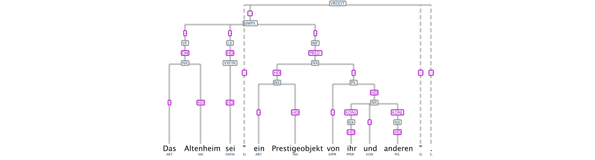
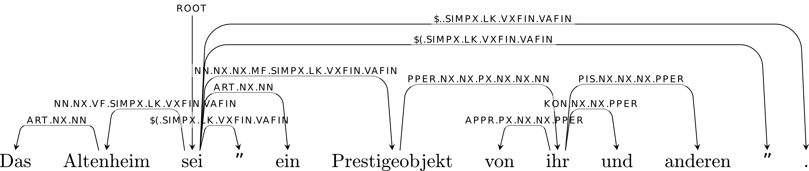

# Assignment 6: Parsing

You need to follow the link on the [private course
page](https://github.com/dsacl3-2019/dsacl3) to work on your repository. The deadline for this assignment is **Monday, February 24th, 8:00 CET**. 

You are strongly recommended to use git properly/productively: commit every 'unit' of work (e.g., individual exercises) and bug fixes separately. You do not need to worry about the mistakes in the earlier commits. Your assignment will be evaluated based only on the final commit before the deadline. Also, don't forget to add your information and the honor code to each file that you modify.

This assignment covers parsing, and has two subproblems. 

**Also, remember that your code is written once and read many times. The classes and methods you implement should be properly documented using docstrings.**

## Constituency to Dependency Parsing Covertor

Your task for this assignment is to write a convertor from constituency to dependency parsing.

You will be working with a small sample of the [TüBa-D/Z treebank](https://uni-tuebingen.de/en/faculties/faculty-of-humanities/departments/modern-languages/department-of-linguistics/chairs/general-and-computational-linguistics/resources/corpora/tueba-dz/), a a manually annotated constituency treebank of German developed at the University of Tübingen.

A sample sentence from this constituency treebank looks like this:



## Input: TüBa XML

The input data is in the TüBa XML format (described in section 9.3 of the [treebank documentation](https://uni-tuebingen.de/index.php?eID=tx_securedownloads&p=134290&u=0&g=0&t=1580394140&hash=3cea3c4cbb97266b1116398cac8d14e8b7a133e3&file=/fileadmin/Uni_Tuebingen/Fakultaeten/Philosophie/Neuphilologie/Seminar_fuer_Sprachwissenschaften/Dokumente/old_server/resources/tuebadz-stylebook-1707.pdf)). A sentence can have nodes that express syntactic categories, e.g. `NX`, relations, named entities, words, etc. An important annotation for us is the `func=HD` attribute, which marks the head of a phrase, e.g. the word `Altenheim` is the head of the noun phrase `Das Altenheim`.

The XML contains, in addition to the information about the word form (`form`), additional information about the lemma of the word (`lemma`) and about its part of speech (`pos`) that we will use. Also, each word is marked with an `id` from 1 to the number of words in the sentence.

```xml
<sentence xml:id="s8">
  <node cat="SIMPX" func="--" xml:id="s8_511">
   <node cat="VF" func="-" parent="s8_511" xml:id="s8_501">
    <node cat="NX" func="ON" parent="s8_501" xml:id="s8_500">
     <relation target="s7_537" type="coreferential" />
     <word   form="Das" func="-" lemma="das" morph="nsn" parent="s8_500" pos="ART" xml:id="s8_1" />
     <word   form="Altenheim" func="HD" lemma="Altenheim" morph="nsn" parent="s8_500" pos="NN" xml:id="s8_2" />
    </node>
   </node>
   <node cat="LK" func="-" parent="s8_511" xml:id="s8_503">
    <node cat="VXFIN" func="HD" parent="s8_503" xml:id="s8_502">
     <word  form="sei" func="HD" lemma="sein" morph="3sks" parent="s8_502" pos="VAFIN" xml:id="s8_3" />
    </node>
   </node>
   <word  form="&quot;" func="--" lemma="&quot;" pos="$(" xml:id="s8_4" />
   <node cat="MF" func="-" parent="s8_511" xml:id="s8_510">
    <node cat="NX" func="PRED" parent="s8_510" xml:id="s8_509">
     <node cat="NX" func="HD" parent="s8_509" xml:id="s8_504">
      <word   form="ein" func="-" lemma="ein" morph="nsn" parent="s8_504" pos="ART" xml:id="s8_5" />
      <word   form="Prestigeobjekt" func="HD" lemma="Prestigeobjekt" morph="nsn" parent="s8_504" pos="NN" xml:id="s8_6" />
     </node>
     <node cat="PX" func="-" parent="s8_509" xml:id="s8_508">
      <word   form="von" func="-" lemma="von" morph="d" parent="s8_508" pos="APPR" xml:id="s8_7" />
      <node cat="NX" func="HD" parent="s8_508" xml:id="s8_507">
       <node cat="NX" func="KONJ" parent="s8_507" xml:id="s8_505">
        <relation target="s6_518" type="anaphoric" />
        <word   form="ihr" func="HD" lemma="sie" morph="dsf3" parent="s8_505" pos="PPER" xml:id="s8_8" />
       </node>
       <word   form="und" func="-" lemma="und" parent="s8_507" pos="KON" xml:id="s8_9" />
       <node cat="NX" func="KONJ" parent="s8_507" xml:id="s8_506">
        <word   form="anderen" func="HD" lemma="anderer|andere|anderes" morph="dp*" parent="s8_506" pos="PIS" xml:id="s8_10" />
       </node>
      </node>
     </node>
    </node>
   </node>
  </node>
  <word  form="&quot;" func="--" lemma="&quot;" pos="$(" xml:id="s8_11" />
  <word  form="." func="--" lemma="." pos="$." xml:id="s8_12" />
 </sentence>
```

## Step 1: Conversion to Unlabelled Dependency Parse

The conversion process of a sentence entails finding, for each word in the sentence, the corresponding head word. 

In many cases, the constituency annotation clearly specify which is the head - e.g. in the sentence above `Prestigeobjekt` is the head of `ein`.

There are, however, also cases where multiple `HD` annotations collide, as is the case of the `NX` `ihr und anderen`. There might also be cases where none of the words are marked as the head by the constituency annotation. In such cases we will use a simple heuristic, namely we will make the leftmost head node (in the example - `ihr`) the head of the whole phrase.

The consitituency annotation includes a topological fields annotation layer - `VF`, `LK`, `MF`. Again, none of the nodes under the `SIMPX` node has a `HD` annotation. The heuristic in this case will be to mark as the head the node under the `LK` node.

Each sentence can be seen as a graph where the words are the nodes and the dependency relations are the edges. You can traverse and process the sentence using any approach you find suitable.

The first step in the conversion step is to parse the input XML file and access the information for each sentence. You are provided with some starter code in `convertor.py`, which uses the [`xml.etree.ElementTree`](https://docs.python.org/3.7/library/xml.etree.elementtree.html) library for parsing the XML input.

The starter code also defines the classes `Node` and `Relation`, and suggests a recursive approach to implementing the `convert()` function. Feel free to use these classes or come up with an entirely original solution.

## Step 2: Adding Dependency Labels

A second step in the conversion is to label each of the relations with the corresponding dependency relation. However, deciding on the exact dependency relation to use entails a lot of linguistic expertise. So we will resort to an heuristic in this case as well.

We will assign labels based on the non-terminal nodes between the dependent and its head. For example, the word `Das` with the head `Altenheim` should have as a dependency label `ART.NX.NN`, the word `und` should have the label `KON.NX.NX.PPER`, `ihr` should have the label `PPER.NX.NX.PX.NX.NX.NN`, `Altenheim` should have the label `NN.NX.VF.SIMPX.LK.VXFIN.VAFIN` etc.

The root node - the node with no parent, should be assigned the label `ROOT` (and `id` 0).

## Output: .conllx Format

The resulting dependency annotations should be written to a file, `sample-sentences.conllx` in [`.conllx` format](https://www.aclweb.org/anthology/W06-2920.pdf). It has 10 fields, separated by tabs. The first column is the id of the word, the second is the word form, the third the word lemma. In the fourth field and fifth field we will add the STTS PoS tag. Field 6 contains an underscore. Field 7 contains the id of the head word, and field 8 the dependency label. The last two fields should contain underscores.

```
1	Das	das	ART	ART	_	2	ART.NX.NN	_	_
2	Altenheim	Altenheim	NN	NN	_	3	NN.NX.VF.SIMPX.LK.VXFIN.VAFIN	_	_
3	sei	sein	VAFIN	VAFIN	_	0	ROOT	_	_
4	"	"	$(	$(	_	3	$(.SIMPX.LK.VXFIN.VAFIN	_	_
5	ein	ein	ART	ART	_	6	ART.NX.NN	_	_
6	Prestigeobjekt	Prestigeobjekt	NN	NN	_	3	NN.NX.NX.MF.SIMPX.LK.VXFIN.VAFIN	_	_
7	von	von	APPR	APPR	_	8	APPR.PX.NX.NX.PPER	_	_
8	ihr	sie	PPER	PPER	_	6	PPER.NX.NX.PX.NX.NX.NN	_	_
9	und	und	KON	KON	_	8	KON.NX.NX.PPER	_	_
10	anderen	anderer|andere|anderes	PIS	PIS	_	8	PIS.NX.NX.NX.PPER	_	_
11	"	"	$(	$(	_	3	$(.s.SIMPX.LK.VXFIN.VAFIN	_	_
12	.	.	$.	$.	_	3	$..s.SIMPX.LK.VXFIN.VAFIN	_	_
```

The sample sentence transformed using the procedure described above will look like this:



As mentioned above, feel free to use as much or as little of the starter code as you like. The only requirement is that when run your convertor produces the `sample-sentences.conllx` file with the corectly converted sample sentences.
